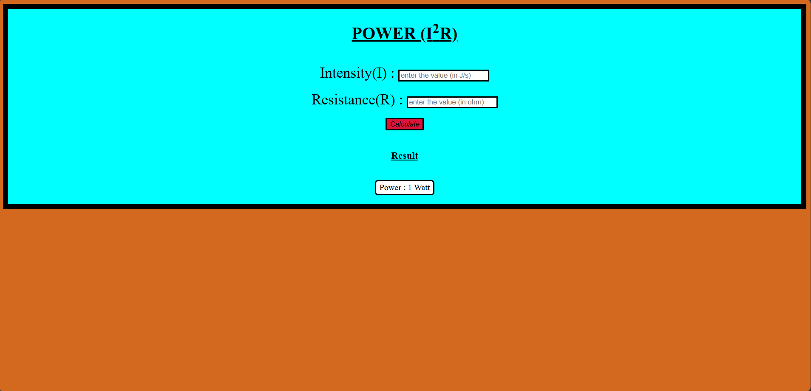

# Ex.05 Design a Website for Server Side Processing
# Date:
# AIM:
To design a website to calculate the power of a lamp filament in an incandescent bulb in the server side.

# FORMULA:
P = I2R
P --> Power (in watts)
 I --> Intensity
 R --> Resistance

# DESIGN STEPS:
## Step 1:
Clone the repository from GitHub.

## Step 2:
Create Django Admin project.

## Step 3:
Create a New App under the Django Admin project.

## Step 4:
Create python programs for views and urls to perform server side processing.

## Step 5:
Create a HTML file to implement form based input and output.

## Step 6:
Publish the website in the given URL.

# PROGRAM :

```
math.html

!DOCTYPE html>
 <html>
    <head>
        <title>power</title>
    </head>
    <body style="background-color: chocolate;">
        <center>
        <div style="border: 10px solid black; background-color:cyan ;" class="math">
            <h1 style="color: black;"><b><u>POWER (I<sup>2</sup>R)</u></b></h1>
            <br>
            <form method = "post">
                
                <label style="font-size: 175%;">Intensity(I) : </label>
                <input placeholder="enter the value (in J/s)" name="intensity" style="border: 3px solid black;" required>
                <br><br>
                <label style="font-size: 175%;">Resistance(R) : </label>
                <input placeholder="enter the value (in ohm)" name="resistance" style="border: 3px solid black;" required>
                <br><br>
                <button type="submit" style="border: 3px solid black;background-color: crimson;"><i>Calculate</i></button>
                <br><br>
            </form>
           
                <h3 style="color: black;"><u><b>Result</b></u></h3>
                <p style="background-color: white;border: 3px solid black;border-radius: 6px;padding:3px 6px; display: inline-block;">Power : {{P}} Watt</p>
            
        </div>
        </center>
    </body>
 </html>

 views.py

 from django.shortcuts import render
def pow(request):
    P = None
    I = None
    R = None
    if request.method == 'POST':
         
        I = int(request.POST.get('intensity',0))
        R = int(request.POST.get('resistance',0))
        P = (I**2)*R
    return render(request, 'app/math.html' ,{"P":P})

url.py

from django.contrib import admin
from django.urls import path
from app import views

urlpatterns = [
    path('admin/', admin.site.urls),
    path('',views.pow, name='pow'),
]

```


# SERVER SIDE PROCESSING:

# HOMEPAGE:

# RESULT:
The program for performing server side processing is completed successfully.
